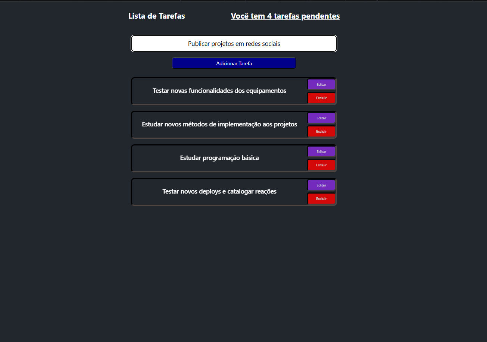

# StickNotes



> Sticky notes web para criar, editar e excluir tarefas com persistência local.

**Demo:** https://sticknotesactivities.vercel.app/

## ✨ Features
- [x] Criar / editar / excluir notas
- [x] Contador de pendentes
- [x] Persistência em localStorage
- [ ] Roadmap: filtros + busca + backend FastAPI/Spring + login

## 🛠️ Stack
React 18, TypeScript, Vite, CSS, Vercel

## 🚀 Como rodar
```bash
npm install
npm run dev
